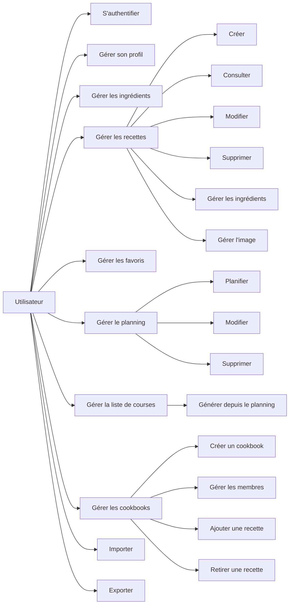
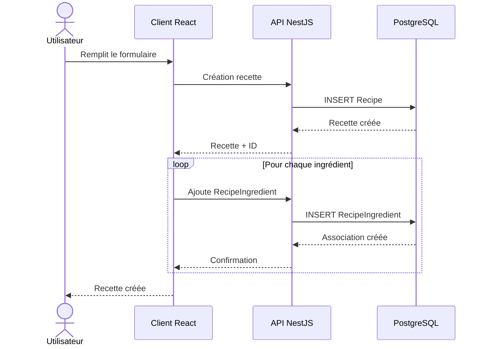
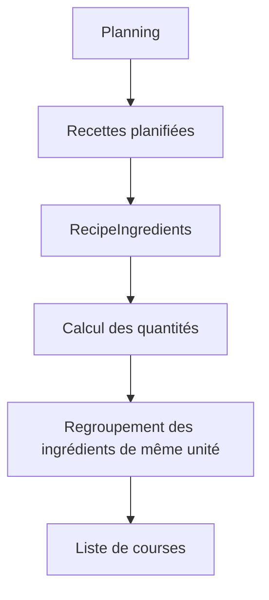

# Conception de l’application SUPMEAL

## 1. Présentation du projet

SUPMEAL est une application web de gestion de recettes et de planification de repas développée dans le cadre d'un projet individuel SUPINFO.

L'application a pour objectif de permettre à un utilisateur de centraliser ses recettes, leurs ingrédients et ses repas au sein d'une interface unique.

Elle permet notamment de :

- créer et gérer un compte ;
- gérer un profil utilisateur ;
- gérer une liste d'ingrédients ;
- créer, consulter, modifier et supprimer des recettes ;
- associer des ingrédients, quantités et unités aux recettes ;
- ajouter des images aux recettes ;
- gérer des favoris ;
- rechercher des recettes ;
- planifier des repas ;
- générer une liste de courses à partir du planning ;
- gérer des cookbooks ;
- importer et exporter des données.

Certaines fonctionnalités collaboratives prévues dans le cahier des charges restent des axes d'évolution.

---

# 2. Objectifs de conception

Les principaux objectifs retenus lors de la conception de SUPMEAL sont :

- disposer d'une architecture claire et modulaire ;
- séparer le client, le serveur et la base de données ;
- centraliser la logique métier côté serveur ;
- conserver une interface simple à utiliser ;
- limiter la duplication du code ;
- utiliser un modèle de données relationnel adapté ;
- assurer la persistance des données ;
- protéger les données personnelles des utilisateurs ;
- permettre l'évolution future vers davantage de fonctionnalités collaboratives.

---

# 3. Architecture retenue

SUPMEAL repose sur trois briques principales :

```text
┌─────────────────────────────┐
│                             │
│        Client React         │
│                             │
└──────────────┬──────────────┘
               │
               │ HTTP / JSON
               ▼
┌─────────────────────────────┐
│                             │
│        API NestJS           │
│                             │
└──────────────┬──────────────┘
               │
               │ Prisma ORM
               ▼
┌─────────────────────────────┐
│                             │
│        PostgreSQL           │
│                             │
└─────────────────────────────┘
```

Cette architecture respecte le principe de séparation demandé dans le cahier des charges.

---

# 4. Responsabilités des composants

## 4.1. Client web

Le client est développé avec React et TypeScript.

Son rôle principal est de :

- afficher l'interface ;
- gérer la navigation ;
- afficher les formulaires ;
- collecter les saisies ;
- transmettre les requêtes à l'API ;
- afficher les réponses et messages d'erreur ;
- conserver uniquement l'état nécessaire à l'interface.

La logique métier principale n'est pas destinée à être placée dans le client.

---

## 4.2. Serveur

Le serveur est développé avec NestJS et TypeScript.

Il assure notamment :

- l'authentification ;
- la validation des requêtes ;
- la gestion des utilisateurs ;
- la gestion des recettes ;
- la gestion des ingrédients ;
- la gestion des relations entre recettes et ingrédients ;
- la gestion des favoris ;
- la gestion du planning ;
- la génération des listes de courses ;
- la gestion des cookbooks ;
- la gestion des imports et exports ;
- le stockage des images de recettes ;
- les contrôles d'accès aux ressources.

---

## 4.3. Base de données

PostgreSQL assure la persistance des données.

Prisma ORM sert d'interface entre NestJS et PostgreSQL.

Le modèle relationnel permet notamment de représenter :

- les utilisateurs ;
- les recettes ;
- les ingrédients ;
- les relations entre recettes et ingrédients ;
- les favoris ;
- les planifications ;
- les listes de courses ;
- les cookbooks ;
- leurs membres.

---

# 5. Organisation du client

Le client utilise une organisation par responsabilité.

```text
client/src/
│
├── components/
├── contexts/
├── hooks/
├── pages/
├── services/
├── types/
├── main.tsx
└── router.tsx
```

---

## 5.1. Pages

Les pages représentent les principales interfaces disponibles pour l'utilisateur.

Parmi elles :

- connexion ;
- inscription ;
- tableau de bord ;
- ingrédients ;
- recettes ;
- création d'une recette ;
- consultation d'une recette ;
- modification d'une recette ;
- favoris ;
- planning ;
- liste de courses ;
- cookbooks ;
- import/export ;
- profil.

---

## 5.2. Services

Les services du client sont chargés de communiquer avec l'API.

Ils permettent d'éviter de placer directement les requêtes HTTP dans toutes les pages.

Exemples :

```text
recipeService
ingredientService
recipeIngredientService
favoriteService
mealPlanService
dataTransferService
authService
cookbookService
```

---

## 5.3. Types

Les interfaces TypeScript décrivent les données manipulées par l'application.

Cette approche permet de conserver un contrat clair entre :

```text
Interface
   ↓
Services HTTP
   ↓
API
```

---

# 6. Organisation du serveur

Le backend NestJS utilise une organisation modulaire.

Une fonctionnalité est généralement composée de :

```text
Module
│
├── Controller
├── Service
└── DTO
```

---

## 6.1. Controller

Le contrôleur reçoit les requêtes HTTP.

Exemple conceptuel :

```text
POST /recipes
        ↓
RecipesController
```

Il transmet ensuite la demande au service métier correspondant.

---

## 6.2. Service

Le service contient la logique de traitement.

Il peut notamment :

- effectuer des vérifications ;
- contrôler la propriété d'une ressource ;
- interroger Prisma ;
- créer ou modifier des données ;
- lancer des traitements métier.

---

## 6.3. DTO

Les DTO permettent de définir et valider la structure des données reçues.

Ils permettent par exemple de contrôler :

- les chaînes ;
- les nombres ;
- les identifiants ;
- les champs facultatifs ;
- certaines contraintes de taille ou de valeur.

---

# 7. Authentification

## 7.1. Compte utilisateur

Un utilisateur peut créer un compte avec une adresse e-mail et un mot de passe.

L'adresse e-mail permet d'identifier le compte.

Le mot de passe ne doit jamais être stocké directement en clair.

---

## 7.2. Connexion

Lors de la connexion :

```text
Adresse e-mail + mot de passe
            ↓
        API NestJS
            ↓
 Vérification des identifiants
            ↓
          JWT
            ↓
      Client authentifié
```

Le JWT permet ensuite d'accéder aux routes protégées.

---

## 7.3. Profil

L'utilisateur peut gérer certaines informations personnelles depuis la page Profil.

Il peut également modifier son mot de passe.

---

## 7.4. OAuth2

La connexion OAuth2 faisait partie des fonctionnalités initialement prévues.

Elle n'est pas intégrée à la version actuelle de SUPMEAL.

L'architecture pourra être étendue pour permettre ultérieurement une connexion via :

- Google ;
- Microsoft ;
- GitHub ;
- ou un autre fournisseur compatible OAuth2.

---

# 8. Conception des recettes

La recette constitue l'entité centrale de l'application.

Une recette contient notamment :

- un nom ;
- une description éventuelle ;
- des instructions ;
- un temps de préparation ;
- un temps de cuisson ;
- un nombre de portions ;
- une difficulté éventuelle ;
- une image éventuelle ;
- des ingrédients associés.

---

## 8.1. Instructions

Dans la version actuelle, les instructions sont enregistrées comme un contenu textuel associé à la recette.

Cela permet à l'utilisateur de renseigner librement les différentes étapes.

Exemple :

```text
1. Mélanger la farine et les œufs.
2. Ajouter progressivement le lait.
3. Mélanger jusqu'à obtenir une pâte homogène.
4. Cuire dans une poêle chaude.
```

Une future évolution pourrait transformer les instructions en entités séparées afin de permettre une gestion individuelle de chaque étape.

---

# 9. Conception des ingrédients

Un ingrédient est défini indépendamment des recettes.

Cela permet de le réutiliser dans plusieurs recettes.

Exemple :

```text
Ingredient
---------
Farine
```

Il peut être utilisé dans :

```text
Crêpes
Pain
Gâteau
Pizza
```

---

## 9.1. Relation recette-ingrédient

La quantité et l'unité dépendent de la recette et non de l'ingrédient lui-même.

Une entité intermédiaire est donc utilisée :

```text
Recipe
   │
   ▼
RecipeIngredient
   │
   ▼
Ingredient
```

`RecipeIngredient` contient notamment :

- la recette ;
- l'ingrédient ;
- la quantité ;
- l'unité ;
- l'ordre.

Exemple :

```text
Recette : Crêpes

Farine    250 g
Lait      500 ml
Œufs        3
```

Cette modélisation permet de réutiliser `Farine` dans une autre recette avec une quantité différente.

---

# 10. Gestion des images

Une recette peut posséder une image.

L'image n'est pas enregistrée directement dans PostgreSQL.

Le fichier est envoyé vers le serveur et placé dans un espace de stockage.

La base conserve une référence vers ce fichier.

Architecture :

```text
Navigateur
    │
    │ Upload
    ▼
API NestJS
    │
    ├── fichier → uploads/
    │
    └── référence → PostgreSQL
```

Cette approche évite de stocker directement de gros fichiers binaires dans la base relationnelle.

---

# 11. Gestion des favoris

Les favoris sont propres à chaque utilisateur.

L'information n'est donc pas stockée directement dans la recette.

Une relation permet d'associer :

```text
User
 │
 ▼
Favorite
 │
 ▼
Recipe
```

Ainsi, une même recette peut être favorite pour un utilisateur sans l'être pour un autre.

---

# 12. Recherche des recettes

La page des recettes propose une recherche destinée à retrouver rapidement une recette.

La recherche peut notamment prendre en compte :

- le nom ;
- la description ;
- les instructions ;
- les ingrédients associés.

La structure backend permet également d'étendre cette recherche à davantage de critères.

---

# 13. Planning des repas

Une planification associe une recette à un repas.

Elle contient notamment :

- la recette ;
- le jour de la semaine ;
- le type de repas ;
- le nombre de portions.

Conceptuellement :

```text
User
 │
 ▼
MealPlan
 │
 ▼
Recipe
```

Un utilisateur peut :

- ajouter un repas ;
- modifier une planification ;
- supprimer une planification.

---

# 14. Génération de la liste de courses

La génération automatique de la liste de courses constitue une fonctionnalité avancée de SUPMEAL.

Elle utilise directement les informations disponibles dans :

```text
Planning
   ↓
Recettes
   ↓
RecipeIngredients
   ↓
Ingrédients
```

---

## 14.1. Calcul

Supposons que deux recettes planifiées utilisent :

```text
Farine — 200 g
```

et :

```text
Farine — 300 g
```

Le résultat peut être regroupé en :

```text
Farine — 500 g
```

Cette conception limite les doublons dans la liste de courses.

---

## 14.2. Gestion des unités

Pour éviter des conversions incorrectes, les quantités ne sont regroupées que lorsque leur unité est identique.

La version actuelle ne réalise pas de conversion automatique entre des unités compatibles.

Une évolution future pourrait implémenter une normalisation des unités.

Exemple :

```text
1000 g → 1 kg
1000 ml → 1 l
```

---

# 15. Conception des cookbooks

Les cookbooks permettent de créer des regroupements de recettes et d'ouvrir l'application à des usages collaboratifs.

La version actuelle permet de gérer les cookbooks, leurs membres et les recettes qui leur sont associées selon les fonctions effectivement disponibles dans l'application.

---

## 15.1. Vision initiale

La conception initiale prévoyait plusieurs rôles :

- créateur ;
- éditeur ;
- commentateur ;
- lecteur.

Elle prévoyait également :

- des invitations ;
- des permissions détaillées ;
- des commentaires ;
- une messagerie.

Ces éléments faisaient partie du modèle conceptuel initial.

---

## 15.2. Version actuelle

La version actuelle permet :

- de créer un cookbook ;
- de consulter les cookbooks auxquels l'utilisateur appartient ;
- de modifier ou supprimer un cookbook lorsqu'il en est propriétaire ;
- d'ajouter et de retirer des membres ;
- d'attribuer différents rôles aux membres ;
- d'afficher les recettes présentes dans un cookbook ;
- d'ajouter une recette personnelle dans un cookbook ;
- de retirer une recette d'un cookbook sans supprimer la recette.

L'ajout et le retrait des recettes respectent les permissions définies par le serveur.

Les rôles `CREATOR` et `EDITOR` peuvent notamment ajouter des recettes dans un cookbook.

Une recette est liée à un cookbook grâce au champ :

```text
Recipe.cookbookId
```

Lorsqu'une recette est ajoutée à un cookbook, son champ `cookbookId` reçoit l'identifiant du cookbook concerné.

Le fonctionnement peut être représenté ainsi :

```text
Recette personnelle
        ↓
Ajout au cookbook
        ↓
Recipe.cookbookId = cookbook.id
```

Lorsqu'une recette est retirée d'un cookbook :

```text
Recipe.cookbookId = null
```

La recette n'est donc pas supprimée. Elle redevient une recette personnelle et peut à nouveau être ajoutée à un cookbook.

Les contrôles de permissions sont effectués côté serveur afin d'empêcher un utilisateur non autorisé d'effectuer une opération, même s'il tente d'appeler directement l'API.

L'interface adapte également les actions proposées selon les permissions de l'utilisateur.

Les fonctions collaboratives suivantes restent des évolutions possibles :

- système complet d'invitations ;
- commentaires sur les recettes ;
- messagerie instantanée ;
- gestion plus avancée et plus granulaire des permissions ;
- recherche propre à chaque cookbook.

---

# 16. Import et export

L'application permet d'importer et d'exporter des données.

La version actuelle prend notamment en charge :

- les recettes ;
- les cookbooks.

---

## 16.1. Export

L'export produit un fichier interprétable contenant les données sélectionnées.

Comme prévu dans le cahier des charges, les données exportées peuvent être lisibles directement.

L'utilisateur doit donc être conscient que le fichier doit être conservé avec précaution.

Aucun secret d'authentification n'est destiné à être exporté.

---

## 16.2. Import

Lors d'un import :

```text
Fichier
  ↓
Validation
  ↓
API
  ↓
Création des données
```

Le serveur conserve la responsabilité de valider les données avant leur enregistrement.

---

# 17. Navigation

La navigation principale a été organisée de manière à suivre le parcours logique d'utilisation.

```text
Tableau de bord
      ↓
Ingrédients
      ↓
Recettes
      ↓
Nouvelle recette
      ↓
Favoris
      ↓
Planning
      ↓
Liste de courses
      ↓
Cookbooks
      ↓
Import / Export
      ↓
Profil
```

Les ingrédients sont volontairement placés avant les recettes puisqu'ils servent à leur composition.

---

# 18. Conception de l'expérience utilisateur

L'interface cherche à limiter le nombre d'actions nécessaires pour réaliser les opérations courantes.

Plusieurs principes ont été retenus :

- navigation persistante ;
- boutons d'action facilement identifiables ;
- icônes accompagnées de tooltips ;
- messages de confirmation ;
- notifications après les actions ;
- dialogues pour certaines opérations ;
- affichage des informations importantes dans les listes ;
- formulaires cohérents entre création et modification.

---

# 19. Responsive

Le layout principal a été conçu pour fonctionner sur plusieurs tailles d'écran.

Sur ordinateur :

```text
Menu latéral | Contenu
```

La barre latérale reste fixe afin de conserver un accès permanent aux différentes fonctionnalités de l'application.

Lorsque la hauteur disponible n'est pas suffisante pour afficher l'ensemble des éléments du menu, la barre latérale devient défilable verticalement.

Cela garantit notamment que les informations de l'utilisateur connecté et le bouton de déconnexion restent toujours accessibles, quelle que soit la hauteur de la fenêtre.

Sur un écran plus petit, la navigation principale est remplacée par un menu mobile pouvant être ouvert à l'aide du bouton prévu à cet effet.

Cette conception permet de conserver une navigation utilisable sur différentes tailles et résolutions d'écran.

---

# 20. Sécurité par conception

La sécurité ne doit pas dépendre uniquement de l'interface.

Les principales règles sont :

- mot de passe jamais stocké en clair ;
- JWT pour les routes privées ;
- validation des données côté serveur ;
- contrôle des propriétaires des ressources ;
- contrôle des permissions sur certaines ressources partagées ;
- absence de secret dans le dépôt ;
- accès à PostgreSQL uniquement depuis le serveur ;
- fichiers utilisateurs séparés du code source.

---

# 21. Containérisation

Docker Compose permet de lancer les trois composants principaux :

```text
frontend
backend
postgres
```

Cela garantit un environnement plus reproductible.

Le frontend est construit puis servi par Nginx.

Le backend exécute NestJS.

PostgreSQL fonctionne dans son propre conteneur.

---

# 22. Persistance

Deux types de données nécessitent une persistance :

## Base de données

Les données PostgreSQL doivent survivre à la recréation d'un conteneur.

Un volume Docker est utilisé.

## Images

Les images uploadées doivent également être conservées indépendamment du cycle de vie du conteneur backend.

Un stockage persistant est donc utilisé pour le dossier d'uploads.

---

# 23. Gestion des erreurs

L'application utilise plusieurs niveaux de gestion d'erreur.

### Client

Le client affiche un message compréhensible à l'utilisateur.

Il peut notamment afficher :

- une notification de succès ;
- une notification d'erreur ;
- une demande de confirmation ;
- un message lorsque certaines données sont manquantes ou incorrectes.

### Serveur

Le serveur vérifie :

- l'existence des ressources ;
- les données reçues ;
- l'accès aux ressources ;
- les permissions ;
- les conflits éventuels.

### Base

Les contraintes relationnelles permettent de maintenir la cohérence des données.

---

# 24. Modularité

Une des décisions importantes du projet a été de séparer les différentes fonctionnalités.

Exemple côté serveur :

```text
RecipesModule
IngredientsModule
RecipeIngredientsModule
FavoritesModule
MealPlansModule
CookbooksModule
```

Cette organisation permet d'ajouter ou de modifier un domaine sans concentrer toute l'application dans un seul service.

---

# 25. Cas d'utilisation



---

# 26. Flux de création d'une recette



---

# 27. Flux de génération d'une liste de courses



---

# 28. Fonctionnalités initialement prévues mais non terminées

Certaines fonctions prévues dans la conception initiale restent à développer ou à approfondir :

- OAuth2 ;
- commentaires ;
- messagerie instantanée ;
- invitations avancées ;
- permissions avancées des cookbooks ;
- préférences culinaires ;
- allergies ;
- certains filtres avancés ;
- recherche propre à chaque cookbook ;
- conversion automatique des unités.

La conception initiale prévoyait bien l'authentification OAuth2 ainsi que les commentaires et la messagerie.

Ces fonctions peuvent être intégrées ultérieurement grâce à l'architecture modulaire choisie.

---

# 29. Améliorations envisagées

Parmi les évolutions possibles :

### Collaboration

- messagerie temps réel avec WebSocket ;
- commentaires par recette ;
- système complet de permissions ;
- invitations par lien ou e-mail ;
- recherche dédiée à chaque cookbook.

### Cuisine

- conversion automatique des unités ;
- préférences alimentaires ;
- allergies ;
- informations nutritionnelles.

### Assistance

- suggestions de recettes selon les ingrédients disponibles ;
- génération intelligente de menus ;
- recommandations selon les préférences.

### Infrastructure

- déploiement public ;
- CI/CD ;
- sauvegardes automatisées ;
- monitoring.

---

# 30. Conclusion

La conception de SUPMEAL repose sur une architecture modulaire et clairement séparée entre client, serveur et base de données.

Les choix techniques retenus permettent de répondre aux principales fonctionnalités du projet tout en conservant une architecture capable d'évoluer.

Le développement s'est concentré en priorité sur les fonctionnalités fondamentales :

- authentification ;
- gestion des recettes ;
- ingrédients structurés ;
- images ;
- favoris ;
- planning ;
- liste de courses automatique ;
- cookbooks ;
- import/export ;
- gestion du profil ;
- déploiement Docker.

Les fonctionnalités collaboratives plus avancées restent compatibles avec l'architecture et constituent les principales évolutions possibles du projet.

---

# 31. Auteure

**Marion LEFEBVRE**

Projet individuel réalisé dans le cadre de la formation SUPINFO.