# Manuel utilisateur — SUPMEAL

## 1. Présentation

SUPMEAL est une application web permettant de gérer des recettes et d'organiser ses repas depuis une interface unique.

L'application permet notamment de :

- créer et gérer un compte utilisateur ;
- gérer une liste d'ingrédients ;
- créer et modifier des recettes ;
- associer des ingrédients et des quantités aux recettes ;
- ajouter des images aux recettes ;
- rechercher des recettes ;
- ajouter des recettes aux favoris ;
- organiser un planning de repas ;
- générer une liste de courses ;
- gérer des cookbooks ;
- importer et exporter des données.

Ce manuel présente les principales fonctionnalités disponibles dans la version actuelle de SUPMEAL.

---

# 2. Accès à l'application

Une fois SUPMEAL démarré, l'utilisateur accède à l'application depuis son navigateur web.

Les fonctionnalités personnelles nécessitent une authentification.

Un utilisateur ne possédant pas encore de compte doit commencer par en créer un.

---

# 3. Création d'un compte

Depuis la page de connexion, sélectionner l'option permettant de créer un compte.

Le formulaire d'inscription demande les informations nécessaires à la création du compte.

Il faut notamment renseigner :

- une adresse e-mail valide ;
- un mot de passe respectant les contraintes indiquées ;
- les éventuelles informations personnelles proposées par le formulaire.

Une fois les informations renseignées, valider la création du compte.

Si les données sont valides, le compte est créé.

L'utilisateur peut ensuite se connecter à SUPMEAL.

---

## Connexion avec Google

Depuis la page de connexion, l'utilisateur peut également sélectionner **Continuer avec Google**. Après authentification auprès de Google, il est redirigé vers SUPMEAL et connecté automatiquement. Si l'adresse e-mail Google correspond à un compte SUPMEAL existant, le compte Google est associé à ce compte ; sinon, un nouveau compte SUPMEAL est créé.


# 4. Connexion

Depuis la page de connexion :

1. saisir l'adresse e-mail du compte ;
2. saisir le mot de passe ;
3. sélectionner **Se connecter**.

Si les identifiants sont corrects, l'utilisateur accède à l'espace principal de SUPMEAL.

En cas d'identifiants incorrects, un message indique que la connexion n'a pas pu aboutir.

### Aperçu de la page de connexion

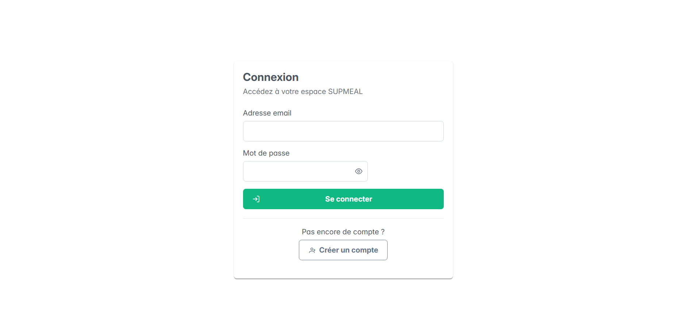

---

# 5. Navigation dans l'application

Après connexion, un menu permet d'accéder aux différentes parties de SUPMEAL.

L'organisation principale comprend notamment :

```text
Tableau de bord
Ingrédients
Recettes
Nouvelle recette
Favoris
Planning
Liste de courses
Cookbooks
Import / Export
Profil
```

Chaque rubrique correspond à un domaine fonctionnel de l'application.

Sur les écrans disposant d'une hauteur réduite, la barre latérale peut être parcourue verticalement afin de conserver l'accès à l'ensemble des rubriques et au bouton de déconnexion.

---

# 6. Tableau de bord

Le tableau de bord constitue le point d'entrée principal après la connexion.

Il permet d'accéder rapidement aux fonctionnalités importantes de l'application.

Depuis le menu latéral, l'utilisateur peut ensuite naviguer vers les différentes sections de SUPMEAL.

### Aperçu du tableau de bord

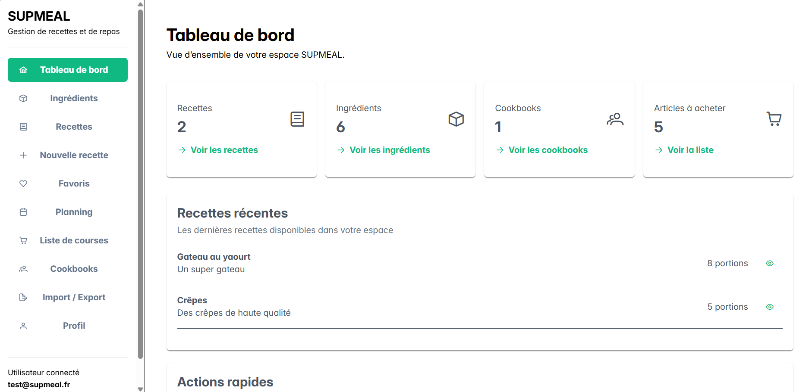

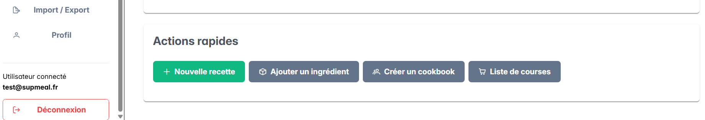

---

# 7. Gestion des ingrédients

## 7.1. Accéder aux ingrédients

Sélectionner **Ingrédients** dans le menu.

Cette page permet de gérer les ingrédients pouvant être utilisés dans les recettes.

---

## 7.2. Ajouter un ingrédient

Utiliser le bouton prévu pour ajouter un nouvel ingrédient.

Renseigner les informations demandées puis valider.

L'ingrédient devient ensuite disponible pour être associé aux recettes.

---

## 7.3. Utilisation dans les recettes

Les ingrédients créés peuvent être sélectionnés lors de la création ou de la modification d'une recette.

Pour chaque ingrédient associé à une recette, SUPMEAL permet de renseigner notamment :

- une quantité ;
- une unité.

Exemple :

```text
Farine : 250 g
Lait : 500 ml
Œufs : 3
```

### Aperçu de la gestion des ingrédients

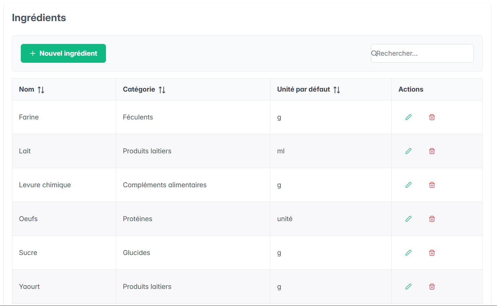

---

# 8. Gestion des recettes

La section Recettes regroupe les recettes de l'utilisateur.

Elle permet notamment :

- de consulter la liste des recettes ;
- de rechercher une recette ;
- de consulter son contenu ;
- de modifier une recette ;
- de supprimer une recette ;
- de gérer les favoris.

### Aperçu de la liste des recettes

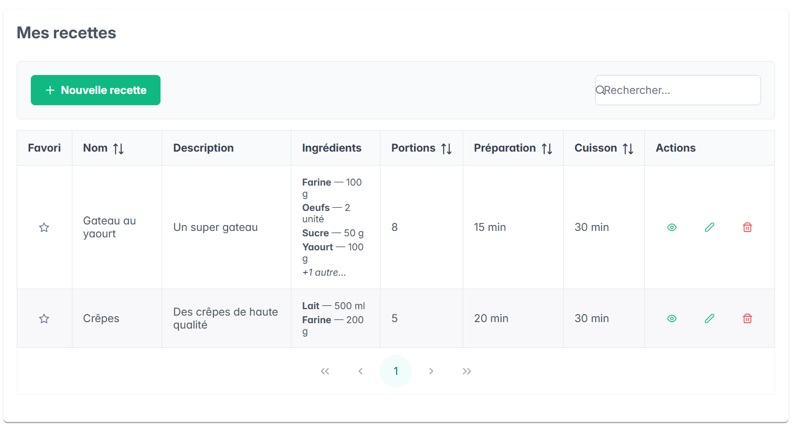

---

# 9. Création d'une recette

## 9.1. Accéder au formulaire

Pour créer une recette, sélectionner :

Nouvelle recette

ou utiliser le bouton de création disponible depuis la page des recettes.

---

## 9.2. Informations générales

Le formulaire permet de renseigner les différentes informations de la recette.

Selon les informations disponibles, il est possible de définir notamment :

- le nom ;
- la description ;
- les instructions ;
- le temps de préparation ;
- le temps de cuisson ;
- le nombre de portions ;
- la difficulté ;
- une image.

---

## 9.3. Instructions

Les étapes nécessaires à la préparation peuvent être renseignées dans la partie dédiée aux instructions.

Il est recommandé de les écrire dans l'ordre de réalisation afin de faciliter la lecture de la recette.

Exemple :

```text
1. Mélanger la farine et les œufs.
2. Ajouter progressivement le lait.
3. Mélanger jusqu'à obtenir une pâte homogène.
4. Faire cuire les crêpes dans une poêle chaude.
```

---

# 10. Ajouter des ingrédients à une recette

Lors de la création d'une recette, l'utilisateur peut lui associer des ingrédients.

Pour chaque ingrédient, il peut renseigner :

- l'ingrédient concerné ;
- la quantité ;
- l'unité.

Exemple :

| Ingrédient | Quantité | Unité |
| --- | ---: | --- |
| Farine | 250 | g |
| Lait | 500 | ml |
| Œufs | 3 | unité |

Une recette peut contenir plusieurs ingrédients.

Après validation, les ingrédients sont enregistrés avec la recette.

---

# 11. Ajouter une image à une recette

SUPMEAL permet d'associer une image à une recette.

Depuis le formulaire de création, utiliser le contrôle permettant de sélectionner une image.

L'image peut être choisie directement depuis le stockage de l'appareil utilisé.

Après sélection et enregistrement de la recette, l'image est envoyée vers le serveur et associée à la recette.

Elle peut ensuite être affichée dans l'application.

L'image est optionnelle : une recette peut être créée sans image.

---

# 12. Consulter une recette

Depuis la liste des recettes, utiliser le bouton Voir associé à la recette souhaitée.

La fiche détaillée présente les informations de la recette, notamment :

- son nom ;
- sa description ;
- son image lorsqu'elle en possède une ;
- le nombre de portions ;
- le temps de préparation ;
- le temps de cuisson ;
- la difficulté ;
- ses ingrédients ;
- les quantités ;
- les unités ;
- les instructions.

Cette vue permet de consulter la recette sans entrer dans le formulaire de modification.

### Aperçu d'une fiche recette

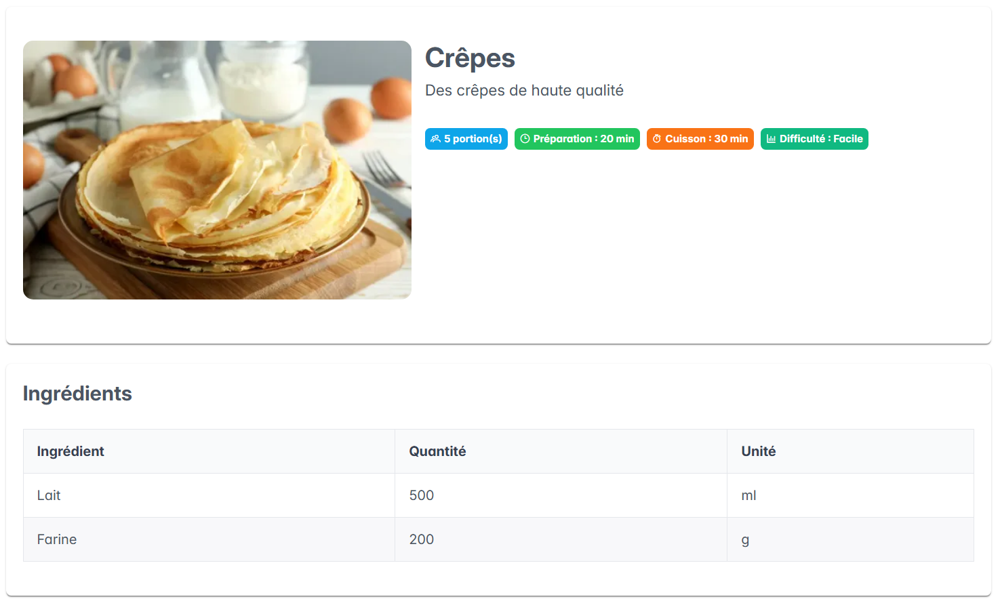

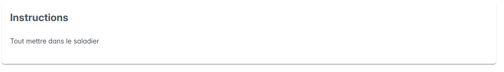

---

# 13. Modifier une recette

Depuis la liste des recettes ou la fiche détaillée, utiliser le bouton Modifier.

Le formulaire de modification permet de mettre à jour les informations existantes.

L'utilisateur peut notamment modifier :

- le nom ;
- la description ;
- les instructions ;
- les temps ;
- les portions ;
- la difficulté ;
- l'image ;
- les ingrédients ;
- leurs quantités ;
- leurs unités.

Il est également possible d'ajouter ou de retirer des ingrédients.

Après les modifications, enregistrer la recette.

### Aperçu de la modification d'une recette

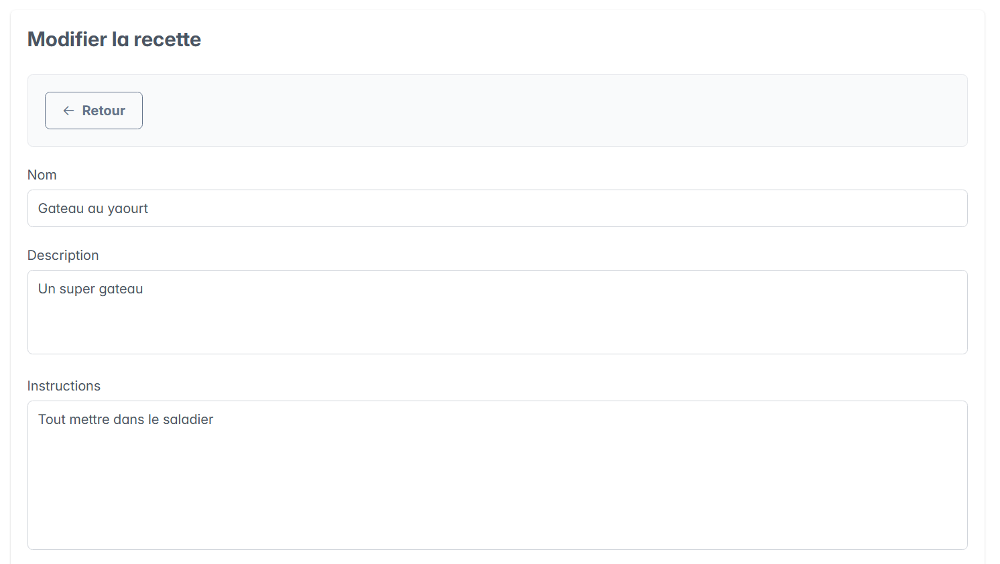

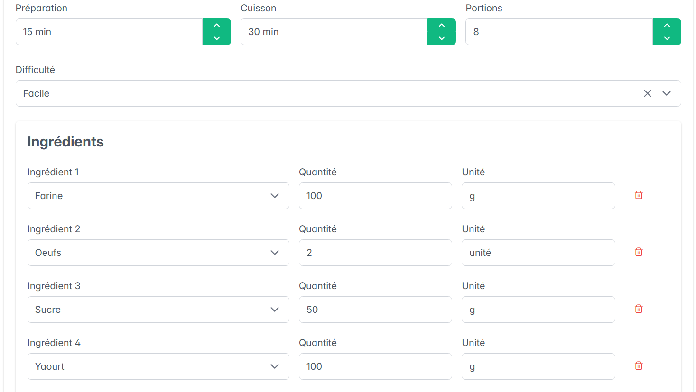

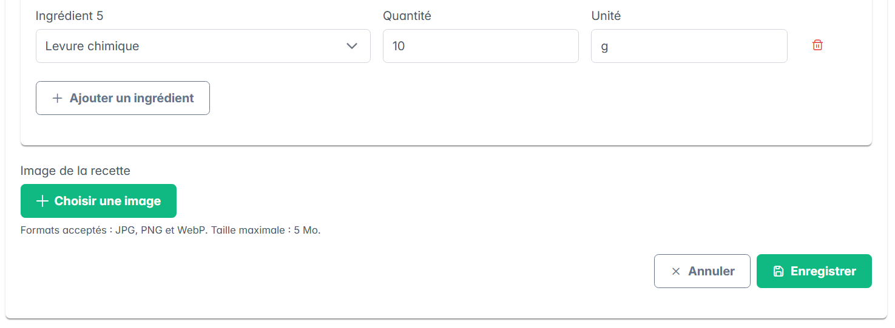

---

# 14. Modifier l'image d'une recette

Depuis le formulaire de modification, l'utilisateur peut remplacer l'image existante par une nouvelle image.

Il peut également retirer l'image de la recette.

Après enregistrement, la modification est appliquée à la recette.

---

# 15. Supprimer une recette

Depuis la liste des recettes, utiliser le bouton Supprimer correspondant à la recette.

Une confirmation est demandée afin de limiter les suppressions accidentelles.

Après confirmation, la recette est supprimée.

Cette action doit donc être utilisée avec précaution.

---

# 16. Aperçu des ingrédients dans la liste des recettes

La liste des recettes affiche également un aperçu de leurs ingrédients.

Pour conserver un tableau lisible, seuls les premiers ingrédients sont affichés directement.

Par exemple :

```text
Farine — 250 g
Lait — 500 ml
Œufs — 3
Beurre — 50 g
+2 autres...
```

La fiche détaillée permet de consulter la liste complète.

---

# 17. Recherche de recettes

Une barre de recherche est disponible dans la section des recettes.

Elle permet de retrouver plus rapidement une recette.

La recherche peut notamment prendre en compte les informations textuelles des recettes et les noms des ingrédients associés.

Par exemple, une recherche :

```text
tomate
```

peut permettre de retrouver les recettes contenant cet ingrédient.

---

# 18. Favoris

## 18.1. Ajouter une recette aux favoris

Depuis la liste des recettes, utiliser le bouton représentant le favori associé à la recette.

La recette est alors marquée comme favorite.

---

## 18.2. Retirer un favori

Utiliser à nouveau le bouton de favori.

La recette est retirée des favoris sans être supprimée.

---

## 18.3. Consulter les favoris

Sélectionner Favoris dans le menu.

Cette page permet de retrouver les recettes précédemment marquées comme favorites.

---

# 19. Planning des repas

La section Planning permet d'organiser les repas à l'avance.

Une recette peut être associée à une planification.

---

## 19.1. Ajouter un repas au planning

Depuis la page de planning, utiliser le bouton permettant d'ajouter une planification.

Sélectionner les informations demandées, notamment :

- la recette ;
- le jour de la semaine ;
- le type de repas ;
- le nombre de portions.

Valider ensuite l'ajout.

La recette apparaît dans le planning.

---

## 19.2. Modifier une planification

Une planification existante peut être modifiée.

Utiliser le bouton Modifier correspondant au repas souhaité.

Effectuer les changements puis enregistrer.

---

## 19.3. Supprimer une planification

Utiliser le bouton Supprimer associé à la planification.

Après confirmation, le repas est retiré du planning.

La recette elle-même n'est pas supprimée.

### Aperçu du planning

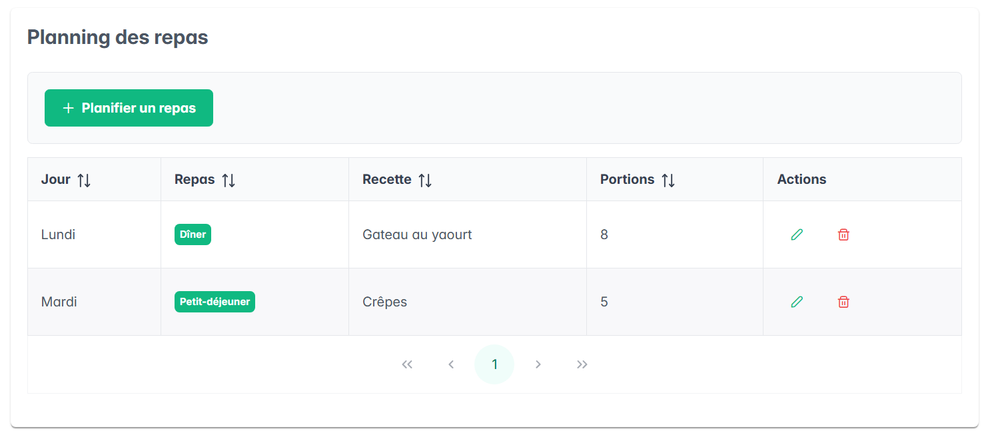

---

# 20. Liste de courses

La section Liste de courses permet de gérer les ingrédients nécessaires aux repas.

Une liste peut être générée à partir du planning.

### Aperçu de la liste de courses

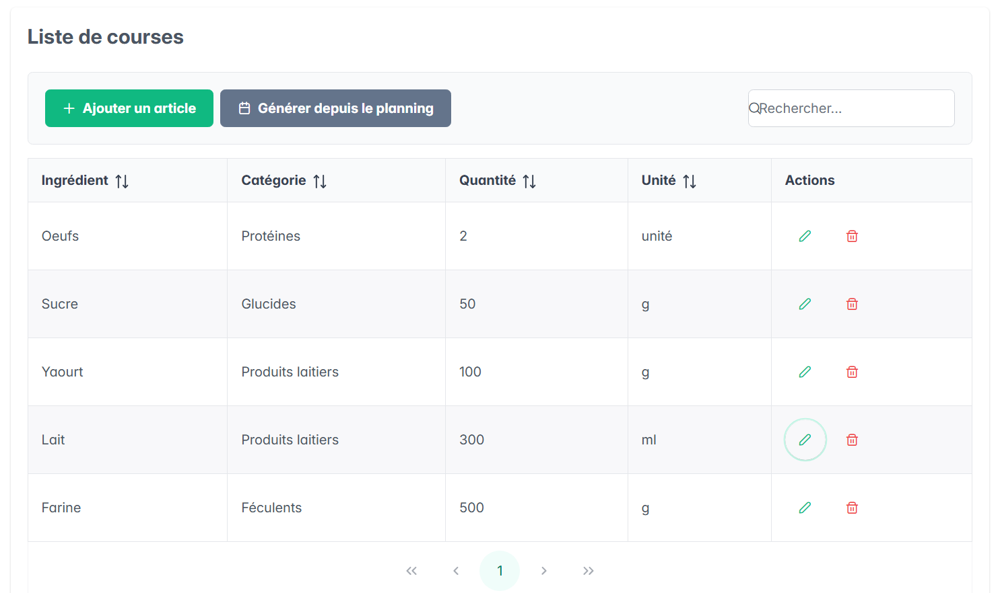

---

## 20.1. Génération depuis le planning

Lorsque plusieurs recettes sont planifiées, SUPMEAL peut récupérer leurs ingrédients afin de construire la liste de courses.

Le nombre de portions sélectionné dans le planning peut être utilisé pour adapter les besoins.

---

## 20.2. Regroupement des ingrédients

Lorsque plusieurs recettes utilisent le même ingrédient avec la même unité, SUPMEAL additionne automatiquement les quantités.

Exemple :

```text
Recette A
Farine : 200 g

Recette B
Farine : 300 g
```

La liste de courses obtient :

```text
Farine : 500 g
```

Cela évite d'obtenir plusieurs lignes identiques pour un même produit.

---

## 20.3. Unités différentes

La version actuelle ne convertit pas automatiquement les unités compatibles.

Par exemple :

```text
Farine : 1000 g
Farine : 1 kg
```

ne sont pas automatiquement transformés en :

```text
Farine : 2 kg
```

Cette conversion constitue une amélioration envisageable.

# 21. Cookbooks

La section Cookbooks permet de créer des espaces regroupant plusieurs recettes et plusieurs membres.

---

## 21.1. Créer un cookbook

Depuis la page Cookbooks, sélectionner :

Nouveau cookbook

Renseigner le nom souhaité puis enregistrer.

Le créateur devient automatiquement propriétaire du cookbook.

Une notification confirme la création lorsque l'opération a réussi.

---

## 21.2. Consulter un cookbook

Utiliser le bouton Voir associé au cookbook.

La fenêtre affiche notamment :

- les membres ;
- leurs rôles ;
- les recettes actuellement présentes dans le cookbook.

---

## 21.3. Ajouter un membre

Le propriétaire du cookbook peut utiliser le bouton Ajouter un membre.

Il doit renseigner :

- l'adresse e-mail de l'utilisateur ;
- le rôle à lui attribuer.

Les rôles proposés sont :

- éditeur ;
- lecteur ;
- commentateur.

L'utilisateur ajouté doit déjà posséder un compte SUPMEAL.

Après validation :

- une notification confirme l'ajout si l'opération réussit ;
- un message d'erreur est affiché si le compte n'existe pas ou si l'utilisateur est déjà membre du cookbook.

---

## 21.4. Retirer un membre

Le propriétaire du cookbook peut retirer un membre depuis la liste des membres.

Une confirmation est demandée avant le retrait.

Après validation, une notification confirme l'opération.

Le créateur du cookbook ne peut pas être retiré de son propre cookbook.

---

## 21.5. Ajouter une recette

Un utilisateur disposant des droits nécessaires peut sélectionner Ajouter une recette.

Une liste des recettes personnelles disponibles est proposée.

Sélectionner la recette souhaitée puis valider.

Une notification confirme l'ajout.

La recette apparaît ensuite dans la section Recettes du cookbook.

Une recette déjà associée à un autre cookbook doit d'abord être retirée de celui-ci avant de pouvoir être ajoutée à un nouveau cookbook.

---

## 21.6. Retirer une recette

Depuis le détail d'un cookbook, utiliser le bouton permettant de retirer une recette.

Une confirmation est demandée.

Après validation, une notification confirme le retrait.

La recette est uniquement retirée du cookbook : elle n'est pas supprimée du compte de son créateur.

Elle redevient alors disponible en tant que recette personnelle.

---

## 21.7. Permissions

Les actions disponibles dépendent du rôle de l'utilisateur.

Les rôles CREATOR et EDITOR permettent notamment d'ajouter des recettes.

Les rôles READER et COMMENTER disposent de droits plus limités. Les contrôles de permissions sont appliqués côté serveur et l'interface masque les actions non autorisées.

Les commentaires et la messagerie instantanée sont disponibles dans les cookbooks selon les droits du membre.

### Commenter une recette partagée

Depuis l'aperçu d'une recette d'un cookbook, un membre disposant de la permission nécessaire peut consulter et publier des commentaires. Les commentaires sont liés à la recette et à leur auteur.

### Utiliser la messagerie instantanée

Le détail d'un cookbook dispose également d'une messagerie. Les messages sont synchronisés en temps réel entre les membres connectés au cookbook.

### Rechercher dans un cookbook

Une barre de recherche permet de filtrer les recettes du cookbook à partir du nom, de la description, des instructions, des ingrédients ou des tags.

### Aperçu de la gestion des cookbooks

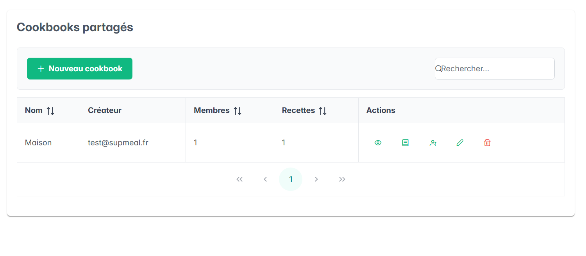

---

# 22. Import et export

La section Import / Export permet de transférer les données de SUPMEAL.

Elle concerne notamment :

- les recettes ;
- les cookbooks.

---

## 22.1. Exporter les données

Utiliser la fonction d'export disponible dans la page Import / Export.

L'application génère un fichier contenant les données exportées.

Ce fichier permet notamment :

- de conserver une sauvegarde ;
- de transférer des données ;
- de préparer une migration.

Les données exportées sont lisibles et doivent donc être conservées dans un emplacement approprié.

---

## 22.2. Importer des données

Depuis la même page, sélectionner la fonction d'import.

Choisir un fichier compatible puis lancer l'import.

Les données reconnues par SUPMEAL sont alors intégrées au compte de l'utilisateur.

Il est recommandé de vérifier le contenu du fichier avant son import.

---

# 23. Profil

La section Profil permet de consulter et modifier les informations liées au compte.

Selon les informations disponibles dans l'application, l'utilisateur peut mettre à jour ses données personnelles.

Il peut notamment modifier :

- son prénom ;
- son nom ;
- son mot de passe.

---

# 24. Modification du mot de passe

La gestion du profil permet également de modifier le mot de passe du compte.

Pour des raisons de sécurité, il est recommandé d'utiliser un mot de passe suffisamment long et difficile à deviner.

Le mot de passe ne doit pas être communiqué à d'autres personnes.

---

# 25. Déconnexion

Lorsque l'utilisateur a terminé d'utiliser SUPMEAL, il peut utiliser la fonction Déconnexion située dans la barre latérale.

La session active est alors terminée et l'application revient vers la partie publique ou la page de connexion.

Sur un appareil partagé, il est recommandé de toujours se déconnecter après utilisation.

Lorsque la hauteur de la fenêtre est insuffisante pour afficher toute la barre latérale, celle-ci peut être parcourue verticalement afin de conserver l'accès au bouton Déconnexion.

---

# 26. Messages et confirmations

SUPMEAL utilise différents messages pour informer l'utilisateur du résultat de ses actions.

Des notifications peuvent notamment apparaître après :

- la création d'une recette ;
- une modification ;
- une suppression ;
- l'ajout d'un favori ;
- le retrait d'un favori ;
- la création ou la modification d'un cookbook ;
- l'ajout d'un membre à un cookbook ;
- le retrait d'un membre d'un cookbook ;
- l'ajout d'une recette à un cookbook ;
- le retrait d'une recette d'un cookbook ;
- une erreur de chargement ;
- une erreur de validation.

Certaines opérations sensibles, comme les suppressions ou les retraits, utilisent également une demande de confirmation.

---

# 27. Utilisation conseillée

Pour profiter correctement des différentes fonctionnalités, un ordre d'utilisation possible est :

```text
1. Créer un compte
        ↓
2. Se connecter
        ↓
3. Créer les ingrédients
        ↓
4. Créer les recettes
        ↓
5. Associer les ingrédients aux recettes
        ↓
6. Ajouter éventuellement des favoris
        ↓
7. Ajouter des recettes au planning
        ↓
8. Générer la liste de courses
        ↓
9. Créer éventuellement un cookbook
        ↓
10. Ajouter des membres et des recettes au cookbook
```

L'import peut également être utilisé pour récupérer directement des données existantes.

---

# 28. Exemple de scénario complet

Un utilisateur souhaite préparer des crêpes.

### Étape 1 — Ingrédients

Il crée ou sélectionne :

```text
Farine
Lait
Œufs
Beurre
```

### Étape 2 — Recette

Il crée une recette :

```text
Nom : Crêpes
Portions : 4
Préparation : 15 minutes
Cuisson : 20 minutes
```

Puis il associe :

```text
Farine : 250 g
Lait : 500 ml
Œufs : 3
Beurre : 50 g
```

Il peut également ajouter une image.

### Étape 3 — Planning

Il ajoute la recette au planning pour le jour et le repas souhaités.

### Étape 4 — Liste de courses

Il génère la liste de courses depuis le planning.

SUPMEAL récupère automatiquement les ingrédients nécessaires.

Si d'autres recettes planifiées utilisent les mêmes ingrédients avec les mêmes unités, les quantités sont regroupées.

### Étape 5 — Cookbook

L'utilisateur peut également créer un cookbook afin de regrouper cette recette avec d'autres recettes.

Il peut ensuite ajouter des membres disposant de différents rôles et, selon les permissions, ajouter ou retirer des recettes du cookbook.

---

# 29. Fonctionnalités restant à approfondir

La version actuelle couvre les principales fonctionnalités prévues, notamment Google OAuth2, la messagerie instantanée, les commentaires collaboratifs, la recherche interne aux cookbooks, les préférences alimentaires et les allergies.

Les principaux axes d'amélioration restants sont :

- un système complet d'invitations par lien ou par e-mail ;
- une granularité supplémentaire des permissions des cookbooks ;
- la conversion automatique entre unités compatibles ;
- une planification sur plusieurs semaines ;
- une couverture de tests automatisés plus complète ;
- le déploiement public et la CI/CD.

---

# 30. En cas de problème

## Impossible de se connecter

Vérifier :

- l'adresse e-mail ;
- le mot de passe ;
- que l'application est correctement démarrée.

Si l'application est exécutée localement, le serveur et PostgreSQL doivent être disponibles.

---

## Impossible d'ajouter un membre à un cookbook

Vérifier notamment :

- que l'adresse e-mail renseignée correspond à un compte SUPMEAL existant ;
- que l'utilisateur n'est pas déjà membre du cookbook ;
- que l'utilisateur effectuant l'action est bien propriétaire du cookbook.

---

## Impossible d'ajouter une recette à un cookbook

Vérifier notamment :

- que la recette appartient à l'utilisateur ;
- que la recette n'est pas déjà associée à un autre cookbook ;
- que l'utilisateur possède le rôle nécessaire dans le cookbook.

---

## Une image ne s'affiche pas

Vérifier que :

- l'image a bien été enregistrée avec la recette ;
- le serveur est accessible ;
- le fichier existe toujours dans le stockage utilisé par le serveur.

---

## La liste de courses est vide

Vérifier notamment :

- qu'un repas est présent dans le planning ;
- que la recette possède des ingrédients ;
- que les ingrédients disposent des informations nécessaires à la génération.

---

## Une quantité ne fusionne pas avec une autre

Vérifier les unités.

Par exemple :

```text
500 g
```

et :

```text
1 kg
```

peuvent être traités séparément dans la version actuelle.

---

# 31. Résumé des fonctionnalités

| Fonctionnalité | Utilisation principale |
| --- | --- |
| Compte | Créer un espace personnel |
| Connexion | Accéder aux données personnelles |
| Profil | Gérer les informations du compte |
| Ingrédients | Créer les ingrédients utilisés dans les recettes |
| Recettes | Créer, consulter, modifier et supprimer des recettes |
| Images | Illustrer les recettes |
| Recherche | Retrouver rapidement une recette |
| Favoris | Marquer les recettes importantes |
| Planning | Organiser les repas |
| Liste de courses | Calculer les ingrédients nécessaires |
| Cookbooks | Regrouper des recettes et gérer des membres |
| Import | Ajouter des données depuis un fichier |
| Export | Sauvegarder ou transférer les données |

---

# 32. Documentation complémentaire

La documentation technique est disponible dans :

```text
documentation/documentation-technique.md
```

Les informations relatives à la conception sont disponibles dans :

```text
documentation/conception.md
```

Le modèle de données est décrit dans :

```text
documentation/modele-de-donnees.md
```

Le suivi du développement est disponible dans :

```text
documentation/suivi-du-projet.md
```

---

# 33. Auteure

**Marion LEFEBVRE**

Projet individuel réalisé dans le cadre de la formation SUPINFO.