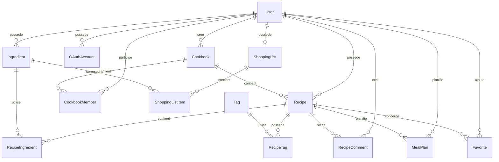

# Modèle de données de SUPMEAL

## 1. Présentation

SUPMEAL utilise une base de données relationnelle PostgreSQL.

L'accès aux données est réalisé à l'aide de Prisma ORM.

Le modèle de données est défini dans :

```text
serveur/prisma/schema.prisma
```

Ce fichier constitue la référence technique principale du schéma réellement implémenté.

---

# 2. Objectifs du modèle

Le modèle de données doit permettre de représenter les principaux domaines fonctionnels de SUPMEAL :

- les utilisateurs ;
- l'authentification ;
- les recettes ;
- les ingrédients ;
- les relations entre recettes et ingrédients ;
- les favoris ;
- les tags ;
- les planifications de repas ;
- les listes de courses ;
- les cookbooks ;
- les membres des cookbooks ;
- les commentaires ;
- les futurs comptes OAuth2.

---

# 3. Vue d'ensemble

Le modèle actuel contient les entités suivantes :

```text
User
OAuthAccount
Ingredient
Recipe
RecipeIngredient
ShoppingList
ShoppingListItem
Cookbook
CookbookMember
RecipeComment
Tag
RecipeTag
Favorite
MealPlan
```

Deux énumérations complètent le modèle :

```text
WeekDay
MealType
```

---

# 4. Schéma relationnel simplifié



---

# 5. Utilisateur — `User`

La table `User` représente un compte utilisateur de SUPMEAL.

## Champs principaux

| Champ | Type | Description |
| --- | --- | --- |
| `id` | UUID | Identifiant unique |
| `email` | String | Adresse e-mail unique |
| `passwordHash` | String? | Mot de passe haché |
| `firstName` | String? | Prénom |
| `lastName` | String? | Nom |
| `profileImage` | String? | Image de profil |
| `defaultServings` | Int | Nombre de portions par défaut |
| `dietaryPreferences` | String[] | Préférences alimentaires |
| `allergies` | String[] | Allergies |
| `preferredCuisines` | String[] | Cuisines préférées |
| `createdAt` | DateTime | Date de création |
| `updatedAt` | DateTime | Date de modification |

`defaultServings` possède une valeur par défaut de :

```text
2
```

L'adresse e-mail est unique.

---

## Relations

Un utilisateur peut posséder :

- plusieurs recettes ;
- plusieurs ingrédients ;
- plusieurs comptes OAuth ;
- une liste de courses ;
- plusieurs cookbooks créés ;
- plusieurs participations à des cookbooks ;
- plusieurs commentaires ;
- plusieurs planifications ;
- plusieurs favoris.

---

# 6. Compte OAuth — `OAuthAccount`

Le modèle `OAuthAccount` est prévu pour associer un compte SUPMEAL à un fournisseur OAuth2.

## Champs

| Champ | Type | Description |
| --- | --- | --- |
| `id` | UUID | Identifiant unique |
| `provider` | String | Fournisseur OAuth |
| `providerAccountId` | String | Identifiant chez le fournisseur |
| `createdAt` | DateTime | Date de création |
| `userId` | UUID | Utilisateur associé |

La combinaison suivante est unique :

```text
provider + providerAccountId
```

Cela évite qu'un même compte externe soit associé plusieurs fois.

---

## État fonctionnel

Le modèle existe dans la base afin de préparer l'intégration OAuth2.

La connexion OAuth2 n'est pas encore disponible dans la version actuelle de l'application.

---

# 7. Ingrédient — `Ingredient`

Le modèle `Ingredient` représente un ingrédient réutilisable.

## Champs

| Champ | Type | Description |
| --- | --- | --- |
| `id` | String | Identifiant unique |
| `name` | String | Nom unique |
| `category` | String? | Catégorie éventuelle |
| `defaultMeasurementUnit` | String? | Unité par défaut |
| `userId` | UUID | Propriétaire de l'ingrédient |
| `createdAt` | DateTime | Date de création |
| `updatedAt` | DateTime | Date de modification |

---

## Exemple

```text
name = "Farine"
category = "Épicerie"
defaultMeasurementUnit = "g"
userId = identifiant de l'utilisateur
```

---

## Relations

Un ingrédient peut être associé :

- à plusieurs recettes ;
- à plusieurs éléments d'une liste de courses.

---

# 8. Recette — `Recipe`

Le modèle `Recipe` représente une recette.

## Champs

| Champ | Type | Description |
| --- | --- | --- |
| `id` | String | Identifiant unique |
| `name` | String | Nom de la recette |
| `description` | String? | Description |
| `preparationTime` | Int? | Temps de préparation |
| `cookingTime` | Int? | Temps de cuisson |
| `servings` | Int? | Nombre de portions |
| `difficulty` | String? | Niveau de difficulté |
| `imageUrl` | String? | Référence vers l'image |
| `sourceUrl` | String? | Source éventuelle |
| `favorite` | Boolean | Ancien indicateur de favori |
| `instructions` | String | Instructions |
| `cookbookId` | String? | Cookbook associé |
| `userId` | UUID | Propriétaire |
| `createdAt` | DateTime | Date de création |
| `updatedAt` | DateTime | Date de modification |

Le champ `instructions` possède une chaîne vide par défaut.

Le champ `favorite` possède la valeur par défaut :

```text
false
```

---

## Remarque sur les favoris

La gestion réellement utilisée des favoris repose sur le modèle `Favorite`, qui relie un utilisateur à une recette.

Le champ booléen `favorite` présent dans `Recipe` est donc redondant avec le modèle relationnel actuel.

Il pourrait être supprimé lors d'une future migration afin d'éviter toute ambiguïté.

---

## Relations

Une recette appartient à :

- un utilisateur ;
- éventuellement un cookbook.

Elle peut posséder :

- plusieurs tags ;
- plusieurs planifications ;
- plusieurs commentaires ;
- plusieurs favoris ;
- plusieurs ingrédients.

Une recette ne peut actuellement être associée qu'à un seul cookbook à la fois grâce au champ facultatif `cookbookId`.

Lorsqu'elle est retirée d'un cookbook, ce champ peut être remis à `null` sans supprimer la recette.

---

# 9. Relation recette-ingrédient — `RecipeIngredient`

`RecipeIngredient` représente l'association entre une recette et un ingrédient.

Cette table est nécessaire car certaines informations dépendent de la recette et non de l'ingrédient lui-même.

## Champs

| Champ | Type | Description |
| --- | --- | --- |
| `id` | String | Identifiant |
| `recipeId` | String | Recette |
| `ingredientId` | String | Ingrédient |
| `quantity` | Float | Quantité |
| `unit` | String? | Unité |
| `order` | Int? | Ordre d'affichage |
| `createdAt` | DateTime | Création |
| `updatedAt` | DateTime | Modification |

---

## Exemple

Pour la recette `Crêpes` :

```text
Farine — 250 g
Lait — 500 ml
Œufs — 3
```

Les quantités sont stockées dans `RecipeIngredient`.

---

## Contrainte d'unicité

La combinaison suivante est unique :

```text
recipeId + ingredientId
```

Un même ingrédient ne peut donc apparaître qu'une seule fois dans une recette.

---

## Suppression

Si une recette est supprimée, ses associations `RecipeIngredient` sont automatiquement supprimées grâce à :

```text
onDelete: Cascade
```

---

# 10. Liste de courses — `ShoppingList`

Chaque utilisateur peut posséder une liste de courses.

## Champs

| Champ | Type | Description |
| --- | --- | --- |
| `id` | String | Identifiant |
| `userId` | UUID | Propriétaire |
| `createdAt` | DateTime | Création |
| `updatedAt` | DateTime | Modification |

---

## Contrainte

`userId` est unique.

Cela signifie qu'un utilisateur possède au maximum une liste de courses principale.

---

# 11. Élément de liste de courses — `ShoppingListItem`

Ce modèle représente une ligne de la liste de courses.

## Champs

| Champ | Type | Description |
| --- | --- | --- |
| `id` | String | Identifiant |
| `shoppingListId` | String | Liste concernée |
| `ingredientId` | String | Ingrédient |
| `quantity` | Float | Quantité |
| `unit` | String? | Unité |
| `checked` | Boolean | État coché/non coché |
| `createdAt` | DateTime | Création |
| `updatedAt` | DateTime | Modification |

`checked` vaut par défaut :

```text
false
```

---

## Relations

Chaque élément appartient :

- à une liste de courses ;
- à un ingrédient.

---

# 12. Cookbook — `Cookbook`

Le modèle `Cookbook` représente un livre de recettes partagé.

## Champs

| Champ | Type | Description |
| --- | --- | --- |
| `id` | String | Identifiant |
| `name` | String | Nom |
| `ownerId` | UUID | Propriétaire |
| `createdAt` | DateTime | Création |
| `updatedAt` | DateTime | Modification |

---

## Relations

Un cookbook possède :

- plusieurs recettes ;
- plusieurs membres ;
- un propriétaire.

Les recettes sont associées au cookbook via leur champ `cookbookId`.

---

## Suppression

La suppression du propriétaire entraîne une suppression en cascade du cookbook dans le schéma actuel.

En revanche, la suppression du cookbook ne supprime pas automatiquement les recettes qui lui sont associées.

Leur champ `cookbookId` est remis à `null`.

---

# 13. Membre d'un cookbook — `CookbookMember`

Cette table représente l'appartenance d'un utilisateur à un cookbook.

## Champs

| Champ | Type | Description |
| --- | --- | --- |
| `id` | String | Identifiant |
| `cookbookId` | String | Cookbook |
| `userId` | UUID | Utilisateur |
| `role` | String | Rôle |

---

## Contrainte

La combinaison :

```text
cookbookId + userId
```

est unique.

Un utilisateur ne peut donc être ajouté qu'une seule fois au même cookbook.

---

## Rôles

Le champ `role` est actuellement une chaîne de caractères.

La version actuelle de l'application utilise notamment les valeurs suivantes :

```text
CREATOR
EDITOR
COMMENTER
READER
```

Le propriétaire du cookbook est enregistré comme membre avec le rôle `CREATOR`.

Les rôles `CREATOR` et `EDITOR` permettent notamment d'ajouter des recettes au cookbook.

Une amélioration possible consisterait à utiliser un enum Prisma dédié afin de limiter les valeurs possibles.

---

# 14. Commentaire de recette — `RecipeComment`

Le modèle existe pour représenter les commentaires associés à une recette.

## Champs

| Champ | Type | Description |
| --- | --- | --- |
| `id` | String | Identifiant |
| `recipeId` | String | Recette |
| `userId` | UUID | Auteur |
| `content` | String | Contenu |
| `createdAt` | DateTime | Création |
| `updatedAt` | DateTime | Modification |

---

## Relations

Chaque commentaire appartient :

- à une recette ;
- à un utilisateur.

Les deux relations utilisent une suppression en cascade.

---

## État fonctionnel

Le modèle existe dans la base de données.

La fonctionnalité complète de commentaires n'est toutefois pas intégrée à l'interface actuelle.

---

# 15. Tag — `Tag`

Le modèle `Tag` représente une étiquette réutilisable.

## Champs

| Champ | Type | Description |
| --- | --- | --- |
| `id` | String | Identifiant CUID |
| `name` | String | Nom unique |

Exemples :

```text
Rapide
Végétarien
Italien
Dessert
```

---

# 16. Relation recette-tag — `RecipeTag`

`RecipeTag` représente la relation plusieurs-à-plusieurs entre les recettes et les tags.

## Champs

```text
recipeId
tagId
```

La clé primaire est composée de ces deux champs :

```text
recipeId + tagId
```

Une même association ne peut donc apparaître qu'une seule fois.

---

# 17. Favori — `Favorite`

Le modèle `Favorite` permet à un utilisateur de marquer une recette comme favorite.

## Champs

| Champ | Type | Description |
| --- | --- | --- |
| `userId` | UUID | Utilisateur |
| `recipeId` | String | Recette |
| `createdAt` | DateTime | Date d'ajout |

---

## Clé primaire

La clé primaire est composée de :

```text
userId + recipeId
```

Une même recette ne peut donc être ajoutée qu'une seule fois aux favoris d'un même utilisateur.

---

## Suppression

Si l'utilisateur ou la recette est supprimé, le favori associé est supprimé automatiquement.

---

# 18. Planification de repas — `MealPlan`

Le modèle `MealPlan` représente un repas planifié.

## Champs

| Champ | Type | Description |
| --- | --- | --- |
| `id` | UUID | Identifiant |
| `userId` | UUID | Utilisateur |
| `recipeId` | String | Recette |
| `servings` | Int? | Nombre de portions |
| `day` | WeekDay | Jour |
| `mealType` | MealType | Type de repas |
| `createdAt` | DateTime | Création |
| `updatedAt` | DateTime | Modification |

---

## Contrainte

La combinaison suivante est unique :

```text
userId + day + mealType
```

Un utilisateur ne peut donc avoir qu'un seul repas planifié pour un même jour et un même type de repas.

---

# 19. Enum `WeekDay`

Les valeurs possibles sont :

```text
MONDAY
TUESDAY
WEDNESDAY
THURSDAY
FRIDAY
SATURDAY
SUNDAY
```

Cet enum permet de limiter les valeurs pouvant être utilisées dans les planifications.

---

# 20. Enum `MealType`

Les valeurs possibles sont :

```text
BREAKFAST
LUNCH
DINNER
```

La collation initialement envisagée dans la conception n'est pas présente dans le schéma Prisma actuel.

---

# 21. Relations principales

Les principales relations peuvent être résumées ainsi :

```text
User
 ├── Recipe
 ├── Ingredient
 ├── OAuthAccount
 ├── ShoppingList
 ├── Cookbook
 ├── CookbookMember
 ├── RecipeComment
 ├── MealPlan
 └── Favorite
```

---

```text
Recipe
 ├── RecipeIngredient
 ├── RecipeTag
 ├── Favorite
 ├── MealPlan
 ├── RecipeComment
 └── Cookbook
```

---

```text
Ingredient
 ├── RecipeIngredient
 └── ShoppingListItem
```

---

# 22. Suppressions en cascade

Le modèle utilise plusieurs stratégies de suppression.

## Utilisateur

Certaines données liées sont supprimées automatiquement lorsque l'utilisateur est supprimé.

Exemples :

- les ingrédients ;
- comptes OAuth ;
- liste de courses ;
- commentaires ;
- favoris ;
- planifications.

---

## Recette

La suppression d'une recette entraîne notamment la suppression :

- des associations recette-ingrédient ;
- des favoris ;
- des planifications ;
- des commentaires ;
- des relations avec les tags.

---

## Cookbook

La suppression d'un cookbook entraîne la suppression de ses membres.

Pour une recette appartenant à un cookbook, la relation utilise :

```text
onDelete: SetNull
```

Ainsi, la suppression du cookbook ne supprime pas automatiquement la recette : son `cookbookId` devient nul.

---

# 23. Index et contraintes

Le modèle utilise plusieurs contraintes pour améliorer la cohérence.

## Adresse e-mail

```text
User.email UNIQUE
```

---

## Ingrédient

```text
Ingredient(userId, name) UNIQUE
```

---

## Compte OAuth

```text
provider + providerAccountId UNIQUE
```

---

## Ingrédient d'une recette

```text
recipeId + ingredientId UNIQUE
```

---

## Membre de cookbook

```text
cookbookId + userId UNIQUE
```

---

## Favori

```text
userId + recipeId PRIMARY KEY
```

---

## Planning

```text
userId + day + mealType UNIQUE
```

---

# 24. Choix de modélisation


## Isolation des ingrédients par utilisateur

Les ingrédients sont rattachés directement à leur propriétaire grâce à :

```text
Ingredient.userId
```

## Séparation entre `Ingredient` et `RecipeIngredient`

La quantité n'est pas stockée directement dans `Ingredient`, car elle varie selon la recette.

Cette séparation permet de réutiliser le même ingrédient dans plusieurs recettes.

---

## Séparation entre `Recipe` et `Favorite`

Un favori dépend de l'utilisateur.

Une recette ne peut donc pas simplement être globalement favorite pour tout le monde.

Le modèle `Favorite` représente cette relation de manière correcte.

---

## Liste de courses liée à l'utilisateur

Le modèle impose une liste de courses principale par utilisateur.

Les lignes associées permettent ensuite de conserver les différents ingrédients.

---

## Cookbook et appartenance des membres

Les membres sont séparés du cookbook afin de permettre à plusieurs utilisateurs d'appartenir au même cookbook.

Le rôle est stocké dans la relation `CookbookMember`.

Cette organisation permet d'attribuer à chaque membre un rôle propre au cookbook concerné.

---

## Association d'une recette à un cookbook

Le champ :

```text
Recipe.cookbookId
```

permet d'associer une recette à un cookbook.

Ce champ est facultatif.

Une recette personnelle peut donc avoir :

```text
cookbookId = null
```

Lorsqu'elle est ajoutée à un cookbook :

```text
cookbookId = identifiant_du_cookbook
```

Lorsqu'elle est retirée du cookbook, ce champ revient à :

```text
cookbookId = null
```

Cette modélisation permet de retirer une recette d'un cookbook sans la supprimer.

Elle implique également qu'une recette ne peut être directement associée qu'à un seul cookbook à la fois dans le schéma actuel.

---

# 25. Points à améliorer dans le modèle

Le schéma actuel fonctionne pour la version développée, mais plusieurs améliorations sont envisageables.

## Champ `favorite` redondant

Le champ :

```text
Recipe.favorite
```

est redondant avec le modèle `Favorite`.

Il pourrait être supprimé dans une future migration.

---

## `CookbookMember.role`

Le rôle est actuellement stocké sous forme de chaîne.

Un enum serait plus robuste.

Par exemple :

```text
CREATOR
EDITOR
READER
COMMENTER
```

Cela permettrait notamment :

- d'empêcher l'enregistrement d'une valeur de rôle invalide ;
- d'améliorer la cohérence du modèle ;
- de bénéficier d'un typage plus strict côté Prisma.

---

## Commentaires

Le modèle existe déjà, mais la fonctionnalité n'est pas encore exposée complètement dans l'application.

---

## OAuth2

Le modèle `OAuthAccount` est prêt, mais l'authentification OAuth2 reste à implémenter.

---

## Instructions

Les instructions sont actuellement stockées dans un champ texte de `Recipe`.

Une future version pourrait créer un modèle dédié :

```text
RecipeStep
```

pour gérer individuellement chaque étape.

---

## Unités

Les unités sont stockées comme chaînes de caractères.

Une future normalisation pourrait faciliter :

```text
1000 g = 1 kg
1000 ml = 1 l
```

et améliorer la génération de listes de courses.

---

## Relation recette-cookbook

Le modèle actuel repose sur une relation directe :

```text
Recipe.cookbookId
```

Cette solution est adaptée au fonctionnement actuel de SUPMEAL, dans lequel une recette ne peut être associée qu'à un seul cookbook à la fois.

Si une future version devait permettre à une même recette d'appartenir simultanément à plusieurs cookbooks, une table d'association dédiée pourrait être introduite, par exemple :

```text
CookbookRecipe
```

Elle permettrait alors de représenter une relation plusieurs-à-plusieurs entre `Recipe` et `Cookbook`.

---

# 26. Conclusion

Le modèle de données de SUPMEAL repose sur une base relationnelle adaptée aux fonctionnalités de l'application.

Les relations principales permettent notamment de gérer correctement :

- les recettes personnelles ;
- les ingrédients structurés et isolés par l'utilisateur;
- les favoris personnels ;
- les planifications ;
- les listes de courses ;
- les cookbooks ;
- les membres ;
- les tags.

Prisma apporte une couche d'abstraction fortement typée entre NestJS et PostgreSQL.

Le schéma actuel reste suffisamment modulaire pour intégrer ultérieurement les fonctionnalités collaboratives ou les améliorations prévues.

---

# 27. Référence

Le fichier de référence du modèle est :

```text
serveur/prisma/schema.prisma
```

En cas de différence entre cette documentation et le code, le schéma Prisma présent dans le dépôt constitue la référence réelle.

---

# 28. Auteure

**Marion LEFEBVRE**

Projet individuel réalisé dans le cadre de la formation SUPINFO.