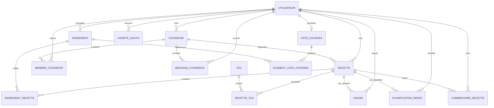

# Schéma relationnel simplifié

Le schéma suivant représente les principales relations de la version actuelle de SUPMEAL.

Le schéma Prisma présent dans `serveur/prisma/schema.prisma` reste la référence exacte pour les noms, types, contraintes et règles de suppression.
